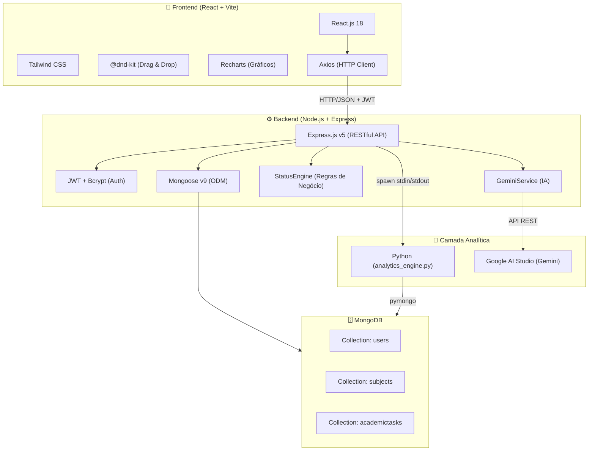
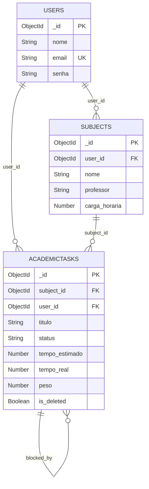
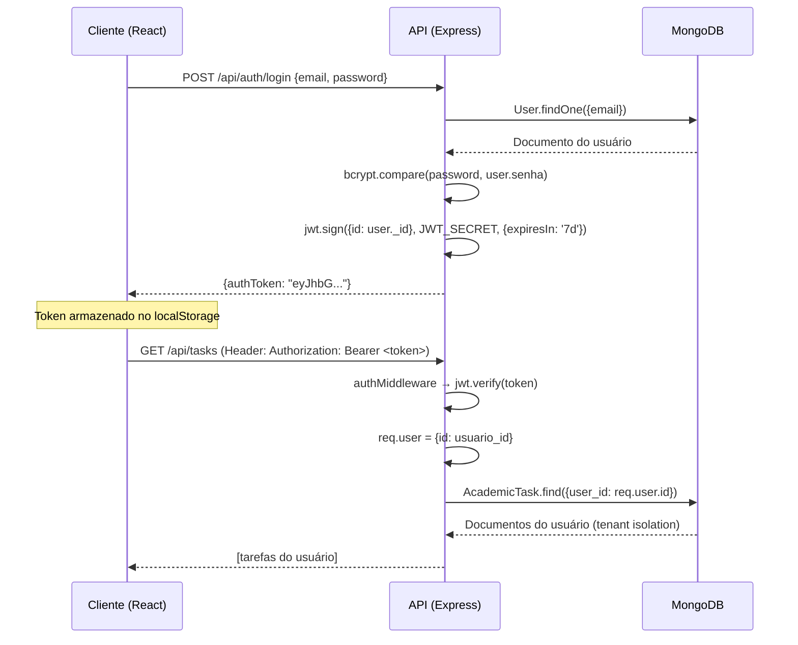
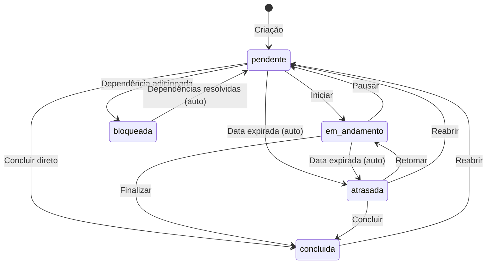
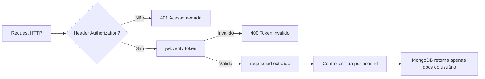
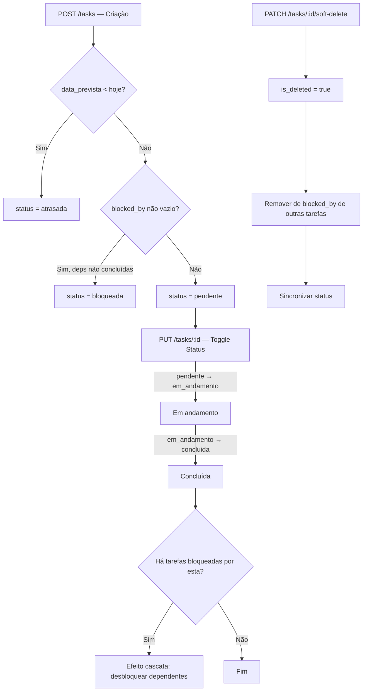

# 📘 EduTrack AI — Especificação Técnica Completa (Stack MongoDB)

**Versão:** 2.0  
**Data:** Maio de 2026  
**Projeto:** EduTrack AI — Assistente Educacional Personalizado  
**Metodologia:** OpenSpec (Spec-Driven Development)  
**Última atualização dos schemas:** Confirmada via auditoria de código em 27/05/2026

---

## 1. Visão Geral e Arquitetura de Integração

O EduTrack AI é uma plataforma inteligente de gestão acadêmica projetada para estudantes de cursos técnicos e superiores que precisam controlar o progresso em múltiplas disciplinas simultâneas. O sistema evoluiu de uma infraestrutura no-code (FlutterFlow + Xano) para uma **stack MERN nativa de código customizado**, altamente performática e extensível.

### 1.1 Diagrama de Arquitetura



### 1.2 Stack Tecnológica Oficial

| Camada | Tecnologia | Versão | Propósito |
|--------|-----------|--------|-----------|
| **Frontend** | React.js | 18.3.1 | SPA com renderização dinâmica |
| **Empacotador** | Vite | 5.4.x | Build e HMR ultra-rápido |
| **Estilização** | Tailwind CSS | 3.4.x | Design system utilitário, dark mode |
| **Drag & Drop** | @dnd-kit | 6.3.x | Kanban board interativo |
| **Gráficos** | Recharts | 3.8.x | PieChart, BarChart, ResponsiveContainer |
| **HTTP Client** | Axios | 1.14.x | Comunicação REST com interceptors JWT |
| **Roteamento** | React Router DOM | 7.13.x | Rotas protegidas e navegação SPA |
| **Backend** | Express.js | 5.2.x | Servidor REST API |
| **ODM** | Mongoose | 9.3.x | Modelagem relacional sobre MongoDB |
| **Autenticação** | JSON Web Token | 9.0.x | Tokens seguros com expiração 7 dias |
| **Hashing** | bcryptjs | 3.0.x | Hash de senha com salt (custo 10) |
| **Upload** | Multer | 2.1.x | Upload de arquivos (attachments) |
| **IA** | @google/generative-ai | 0.24.x | SDK para Gemini (insights) |
| **Banco de Dados** | MongoDB | Community | NoSQL orientado a documentos |
| **Analytics** | Python 3 | 3.x | Motor analítico e geração de PDF |
| **PDF** | matplotlib + fpdf2 | — | Gráficos e relatórios em PDF |
| **Governança** | OpenSpec | — | Especificações e rastreabilidade |

### 1.3 Variáveis de Ambiente

#### Backend (`backend/.env`)
```env
PORT=5000
MONGODB_URI=mongodb://127.0.0.1:27017/edutrack
JWT_SECRET=<chave_secreta_jwt>
GOOGLE_AI_STUDIO_KEY=<api_key_google_ai_studio>
```

#### Frontend (`frontend/.env`)
```env
VITE_API_URL=http://localhost:5000/api
```

> [!CAUTION]
> Arquivos `.env` estão no `.gitignore`. Nunca versione chaves secretas ou URIs de banco de dados.

---

## 2. Modelo de Dados NoSQL (MongoDB Collections)

Toda a persistência utiliza MongoDB via Mongoose ODM. Os schemas utilizam `snake_case` para atributos, `ObjectId` para referências e `timestamps: true` para rastreabilidade automática (`createdAt`, `updatedAt`).

### 2.1 Coleção: `users`

**Modelo Mongoose:** [`User.js`](file:///c:/faculdade/EduTrack-AI/backend/src/models/User.js)

```json
{
  "_id": "ObjectId (auto)",
  "nome": "String (required)",
  "email": "String (required, unique)",
  "senha": "String (required) — hash bcrypt, nunca texto plano",
  "createdAt": "Date (auto)",
  "updatedAt": "Date (auto)"
}
```

**Regras de Negócio:**
- O campo `email` possui índice `unique` para garantir unicidade.
- O campo `senha` armazena exclusivamente o hash bcrypt (salt 10).
- O campo `nome` é o nome de exibição do usuário na interface.

---

### 2.2 Coleção: `subjects`

**Modelo Mongoose:** [`Subject.js`](file:///c:/faculdade/EduTrack-AI/backend/src/models/Subject.js)

```json
{
  "_id": "ObjectId (auto)",
  "user_id": "ObjectId (ref: User, required) — tenant isolation",
  "nome": "String (required)",
  "professor": "String",
  "carga_horaria": "Number",
  "descricao": "String",
  "data_inicio": "String",
  "data_fim": "String",
  "createdAt": "Date (auto)",
  "updatedAt": "Date (auto)"
}
```

**Regras de Negócio:**
- `user_id` garante **tenant isolation** — cada disciplina pertence a exatamente um usuário.
- `carga_horaria` alimenta o cálculo de progresso ponderado (em horas).
- Todas as queries de leitura (`find`) incluem obrigatoriamente `{ user_id: req.user.id }`.

---

### 2.3 Coleção: `academictasks`

**Modelo Mongoose:** [`AcademicTask.js`](file:///c:/faculdade/EduTrack-AI/backend/src/models/AcademicTask.js)

```json
{
  "_id": "ObjectId (auto)",
  "subject_id": "ObjectId (ref: Subject, required)",
  "user_id": "ObjectId (ref: User, required) — tenant isolation",
  "titulo": "String (required)",
  "descricao": "String",
  "data_prevista": "Date",
  "status": "String (enum: ['pendente', 'em_andamento', 'concluida', 'atrasada', 'bloqueada'], default: 'pendente')",
  "priority": "Number (enum: [1, 2, 3, 4], default: 4) — P1=urgente, P4=baixa",
  "tempo_estimado": "Number (default: 0) — em minutos",
  "tempo_real": "Number (default: 0) — em minutos",
  "peso": "Number (default: 1, min: 1, max: 10) — peso para progresso ponderado",
  "tags": "[String] — etiquetas livres",
  "attachments": "[{ file_name: String, file_url: String, file_type: String }]",
  "blocked_by": "[ObjectId (ref: AcademicTask)] — dependências de bloqueio",
  "completed_at": "Date (default: null) — timestamp de conclusão",
  "history": "[{ action: String, timestamp: Date, details: String }] — log de auditoria",
  "is_deleted": "Boolean (default: false) — soft delete (lixeira)",
  "createdAt": "Date (auto)",
  "updatedAt": "Date (auto)"
}
```

**Índices Compostos:**
```javascript
AcademicTaskSchema.index({ user_id: 1, status: 1, data_prevista: 1 });
AcademicTaskSchema.index({ user_id: 1, is_deleted: 1 });
```

**Regras de Negócio:**
- `status` segue uma máquina de estados com transições validadas pelo [`StatusEngine`](file:///c:/faculdade/EduTrack-AI/backend/src/services/statusEngine.js).
- `blocked_by` implementa o sistema de dependências — tarefas bloqueadas não podem ser movidas até que suas dependências sejam concluídas.
- `is_deleted` habilita o padrão *soft delete* com lixeira e opção de desfazer.
- `history` mantém um log imutável de todas as ações realizadas na tarefa.
- `peso` é utilizado no cálculo de progresso ponderado (tarefas com peso maior impactam mais).

---

### 2.4 Diagrama Relacional (Referências entre Coleções)



---

## 3. Especificação da API RESTful

Base URL: `http://localhost:5000/api`

### 3.1 Autenticação (`/api/auth`)

| Método | Rota | Middleware | Descrição |
|--------|------|-----------|-----------|
| `POST` | `/auth/signup` | — | Registro de novo usuário |
| `POST` | `/auth/login` | — | Login com email/senha |
| `GET` | `/auth/me` | `authMiddleware` | Retorna perfil do usuário logado |

**Fluxo de Autenticação:**



**Middleware de Autenticação** ([`authMiddleware.js`](file:///c:/faculdade/EduTrack-AI/backend/src/middleware/authMiddleware.js)):
- Extrai o token do header `Authorization: Bearer <token>`.
- Verifica e decodifica via `jwt.verify()` usando `JWT_SECRET`.
- Injeta `req.user = { id: userId }` para uso em todos os controllers.
- Retorna `401` se token ausente ou `400` se inválido.

---

### 3.2 Disciplinas (`/api/subjects`)

| Método | Rota | Middleware | Descrição |
|--------|------|-----------|-----------|
| `GET` | `/subjects` | `authMiddleware` | Lista todas as disciplinas do usuário |
| `GET` | `/subjects/:id` | `authMiddleware` | Busca disciplina por ID |
| `GET` | `/subjects/analytics` | `authMiddleware` | Métricas analíticas por disciplina |
| `POST` | `/subjects` | `authMiddleware` | Cria nova disciplina |

**Endpoint de Analytics (`GET /subjects/analytics`):**

Retorna progresso ponderado por disciplina e métricas globais. Calcula o status efetivo de cada tarefa em tempo de leitura usando o `StatusEngine`, garantindo que atrasos e desbloqueios reflitam instantaneamente.

Formato de resposta:
```json
{
  "subjects": [
    {
      "id": "ObjectId",
      "nome": "Inteligência Artificial",
      "taskCount": 4,
      "progress": { "progress": 100, "completed": 4, "total": 4, "weightedCompleted": 20, "weightedTotal": 20 },
      "statusDistribution": { "pendente": 0, "em_andamento": 0, "concluida": 4, "atrasada": 0, "bloqueada": 0 },
      "tempo_estimado": 120,
      "tempo_real": 180
    }
  ],
  "global": { "progress": 100, "completed": 4, "total": 4, "weightedCompleted": 20, "weightedTotal": 20 }
}
```

---

### 3.3 Tarefas Acadêmicas (`/api/tasks`)

| Método | Rota | Middleware | Descrição |
|--------|------|-----------|-----------|
| `GET` | `/tasks` | `authMiddleware` | Lista tarefas ativas (com status efetivo) |
| `GET` | `/tasks/trash` | `authMiddleware` | Lista tarefas na lixeira |
| `GET` | `/tasks/:id` | `authMiddleware` | Busca tarefa por ID (com histórico) |
| `POST` | `/tasks` | `authMiddleware` | Cria nova tarefa |
| `PUT` | `/tasks/:id` | `authMiddleware` | Atualiza tarefa (com validação de transição) |
| `POST` | `/tasks/sync-statuses` | `authMiddleware` | Sincroniza status de todas as tarefas |
| `PATCH` | `/tasks/:id/soft-delete` | `authMiddleware` | Move para lixeira (soft delete) |
| `PATCH` | `/tasks/:id/restore` | `authMiddleware` | Restaura da lixeira |
| `DELETE` | `/tasks/:id/permanent` | `authMiddleware` | Exclusão permanente |
| `PATCH` | `/tasks/trash/restore-all` | `authMiddleware` | Restaura todas da lixeira |
| `DELETE` | `/tasks/trash/empty` | `authMiddleware` | Esvazia a lixeira |

---

### 3.4 Analytics e IA (`/api/analytics`)

| Método | Rota | Middleware | Descrição |
|--------|------|-----------|-----------|
| `GET` | `/analytics` | `authMiddleware` | Métricas avançadas (calculadas inline) |
| `GET` | `/analytics/insights` | `authMiddleware` | Insights de IA (Gemini + fallback) |
| `GET` | `/analytics/report/pdf` | `authMiddleware` | Gera relatório PDF (via Python) |

---

### 3.5 Upload (`/api/upload`)

| Método | Rota | Middleware | Descrição |
|--------|------|-----------|-----------|
| `POST` | `/upload` | `authMiddleware` + `multer` | Upload de arquivo (attachments) |

---

## 4. Motor de Regras de Negócio — StatusEngine

**Arquivo:** [`statusEngine.js`](file:///c:/faculdade/EduTrack-AI/backend/src/services/statusEngine.js)

O StatusEngine é o motor centralizado que governa toda a lógica de status das tarefas acadêmicas.

### 4.1 Máquina de Estados



### 4.2 Funções do StatusEngine

| Função | Propósito |
|--------|-----------|
| `computeEffectiveStatus(task, allTasks)` | Calcula o status real considerando deadlines e dependências |
| `computeWeightedProgress(tasks)` | Calcula progresso ponderado pelo campo `peso` |
| `areDependenciesResolved(task, allTasks)` | Verifica se todas as tarefas em `blocked_by` estão concluídas |
| `syncAllStatuses(userId)` | Sincroniza status de todas as tarefas de um usuário em batch |
| `validateTransition(from, to)` | Valida se uma transição manual de status é permitida |

### 4.3 Regras de Detecção Automática

1. **Atraso Atômico:** Se `data_prevista` < `Date.now()` e status não é `concluida` → status efetivo = `atrasada`.
2. **Desbloqueio em Cascata:** Ao concluir uma tarefa, todas as tarefas que a tinham em `blocked_by` são verificadas. Se todas as dependências estão concluídas, o status é automaticamente alterado para `pendente`.
3. **Terminal State:** `concluida` é um estado terminal — nunca muda automaticamente (só por ação manual de reabrir).

### 4.4 Cálculo de Progresso Ponderado

$$\text{Progresso Ponderado} = \frac{\sum_{i=1}^{n} peso_i \times \mathbb{1}[status_i = \text{concluída}]}{\sum_{i=1}^{n} peso_i} \times 100$$

Onde $peso_i$ é o campo `peso` (1–10) de cada tarefa, garantindo que tarefas de maior peso impactem proporcionalmente mais o progresso.

---

## 5. Inteligência Artificial e Motor Analítico

### 5.1 Gemini Service (Real-time Insights)

**Arquivo:** [`geminiService.js`](file:///c:/faculdade/EduTrack-AI/backend/src/services/geminiService.js)

| Aspecto | Detalhe |
|---------|---------|
| **Modelo** | Gemini 2.5 Pro |
| **SDK** | `@google/generative-ai` |
| **Inicialização** | Lazy singleton (instanciado no primeiro uso) |
| **Prompt** | Tutor educacional em PT-BR, 3–5 recomendações acionáveis |
| **Fallback** | Se a API falhar, gera insights baseados em regras locais de desvio |

**Formato de entrada enviado ao Gemini:**
```
- {disciplina}: Progresso {X}%, Desvio de tempo: {+Y%}, Estimado: {N}min, Real: {M}min, Tarefas: {T} ({C} concluídas)
```

**Formato de resposta:**
```json
{
  "recommendations": ["recomendação 1", "recomendação 2", "..."],
  "summary": "Resumo geral de uma frase sobre o desempenho do aluno"
}
```

**Lógica de fallback (sem Gemini):**
- Se `desvio > +20%`: Recomenda reorganização de sessões de estudo.
- Se `desvio < -10%`: Elogia eficiência e sugere aprofundamento.
- Se `desvio = null` (sem dados de tempo): Gera insights baseados em progresso.

### 5.2 Cálculo de Desvio Percentual

$$\text{Desvio \%} = \frac{(tempo\_real - tempo\_estimado)}{tempo\_estimado} \times 100$$

- **Retorna `null`** se `tempo_estimado = 0` (evita divisão por zero).
- **`> +20%`** → Status `acima` (aluno gastando mais tempo que o planejado).
- **`< -10%`** → Status `abaixo` (aluno mais eficiente que o planejado).
- **Entre -10% e +20%** → Status `no_prazo`.

### 5.3 Analytics Controller — Endpoint `/api/analytics`

**Arquivo:** [`analyticsController.js`](file:///c:/faculdade/EduTrack-AI/backend/src/controllers/analyticsController.js)

Calcula métricas analíticas **inline no Node.js** (sem dependência de batch Python) a partir dos dados do MongoDB:

```json
{
  "generated_at": "2026-05-27T21:30:00.000Z",
  "subjects": [
    {
      "id": "ObjectId",
      "nome": "Inteligência Artificial",
      "subject_name": "Inteligência Artificial",
      "progress_weighted": 100.0,
      "total_weight": 20,
      "completed_weight": 20,
      "time_real_min": 180,
      "total_hours": 3.0,
      "time_estimated_min": 120,
      "efficiency_ratio": 1.5,
      "deviation_percent": 50.0,
      "task_count": 4,
      "completed_count": 4
    }
  ],
  "global_metrics": {
    "overall_progress": 100.0,
    "total_points": 20,
    "completed_points": 20,
    "velocity_points_per_min": 0.1111,
    "total_time_spent_min": 180,
    "forecasted_completion_date": "2026-05-28T00:00:00.000Z",
    "global_deviation_percent": 50.0
  },
  "deviations": [
    {
      "subject": "Inteligência Artificial",
      "deviation_percent": 50.0,
      "status": "acima"
    }
  ]
}
```

### 5.4 Analytics Controller — Endpoint `/api/analytics/insights`

Calcula desvios em tempo real e chama o Gemini para recomendações:

```json
{
  "generated_at": "2026-05-27T21:30:00.000Z",
  "deviations": [
    {
      "subject": "Inteligência Artificial",
      "deviation_percent": 50.0,
      "tempo_estimado_min": 120,
      "tempo_real_min": 180,
      "status": "acima"
    }
  ],
  "recommendations": [
    "Você está levando 50% a mais de tempo em IA. Divida suas sessões em blocos de 25 minutos.",
    "Experimente a técnica Pomodoro para melhorar o foco nas suas sessões de estudo."
  ],
  "summary": "Atenção ao tempo de estudo em IA, que está acima do planejado.",
  "metrics": {
    "progress": 100,
    "totalTimeSpent": 180,
    "totalEstimated": 120,
    "globalDeviation": 50.0
  }
}
```

### 5.5 Motor Analítico Python

**Arquivo:** [`analytics_engine.py`](file:///c:/faculdade/EduTrack-AI/scripts/analytics_engine.py)

Opera em dois modos:

| Modo | Comando | Entrada | Saída |
|------|---------|---------|-------|
| **Batch** | `python analytics_engine.py --user-id <id>` | MongoDB direto (`pymongo`) | `data/analytics_report_{userId}.json` |
| **PDF** | `python analytics_engine.py --generate-pdf --output <path>` | JSON via `stdin` (do Node.js) | Arquivo PDF visual |

**Pipeline do PDF:**
1. Node.js calcula métricas + chama Gemini → monta payload JSON.
2. Node.js `spawn('py', ['-3', scriptPath, '--generate-pdf', '--output', pdfPath])`.
3. Payload enviado via `stdin`.
4. Python gera gráficos (`matplotlib`) + monta PDF (`fpdf2`).
5. PDF retornado ao cliente como download blob.

**Conteúdo do PDF:**
- Header: "EduTrack AI — Relatório de Performance Acadêmica".
- Resumo da IA (Gemini ou fallback).
- Recomendações personalizadas.
- Tabela de disciplinas com progresso, tempos e desvios.
- Gráfico de barras: Progresso por Disciplina.
- Gráfico comparativo: Tempo Estimado vs Real.

---

## 6. Frontend — Componentes e Páginas

### 6.1 Mapa de Rotas (React Router DOM v7)

| Rota | Componente | Acesso |
|------|-----------|--------|
| `/login` | `LoginView.jsx` | Público |
| `/dashboard` | `Dashboard.jsx` | Protegido (JWT) |
| `/disciplinas` | `SubjectsView.jsx` | Protegido |
| `/disciplinas/nova` | `CreateSubjectView.jsx` | Protegido |
| `/disciplinas/:id` | `SubjectDetailView.jsx` | Protegido |
| `/tarefas/nova` | `CreateTaskView.jsx` | Protegido |
| `/concluidas` | `CompletedTasksView.jsx` | Protegido |
| `/lixeira` | `TrashView.jsx` | Protegido |

### 6.2 Componentes do Dashboard

O Dashboard (`Dashboard.jsx`) é a central de comando do sistema, com as seguintes seções:

| Seção | Descrição |
|-------|-----------|
| **Summary Cards** | 4 cards: Disciplinas, Total Tarefas, Pendências, Produtividade |
| **Progresso Ponderado** | Barra de progresso global baseada em pesos |
| **Gestão de Atividades** | Filtros rápidos (Todas, Atrasadas, Próximas, Concluídas) |
| **Adicionar Tarefa** | Botão de criação rápida (`z-20` para nunca ser sobreposto) |
| **Task Views** | Lista temporal, Calendário, Kanban (alternável) |
| **Caixa de Entrada** | Tarefas sem data prevista aguardando planejamento |
| **Inteligência Estratégica AI** | Velocidade de estudo, ETA, eficiência |
| **Insights Inteligentes** | `AIInsightsCard` com Gemini AI + botão PDF |
| **Gráficos** | Progresso por Disciplina, Tempo Gasto (pie), Estimado vs Real (bar) |

### 6.3 Componentes Reutilizáveis

| Componente | Arquivo | Função |
|-----------|---------|--------|
| `Layout` | `Layout.jsx` | Sidebar + Breadcrumb + Header + Theme Toggle |
| `TaskCardTodoist` | `TaskCardTodoist.jsx` | Card de tarefa estilo Todoist com ações |
| `EditTaskModal` | `EditTaskModal.jsx` | Modal de edição com validação |
| `TaskDetailsModal` | `TaskDetailsModal.jsx` | Modal de detalhes com histórico |
| `CalendarGrid` | `CalendarGrid.jsx` | Visualização de calendário mensal |
| `KanbanView` | `KanbanView.jsx` | Quadro Kanban com drag-and-drop |
| `AIInsightsCard` | `AIInsightsCard.jsx` | Painel de IA com badges de desvio |

### 6.4 Serviços Frontend

| Serviço | Endpoints | Propósito |
|---------|----------|-----------|
| `api.js` | — | Instância Axios com interceptor JWT |
| `authService.js` | signup, login, me | Autenticação |
| `subjectService.js` | getAll, getById, getAnalytics, create | CRUD disciplinas |
| `taskService.js` | getAll, getById, create, update, softDelete, restore, syncStatuses | CRUD tarefas |
| `analyticsService.js` | getAdvancedAnalytics, getAIInsights, downloadPDFReport | Analytics |

---

## 7. Segurança e Tenant Isolation

### 7.1 Isolamento de Dados (Multi-Tenant)

**Regra Inviolável:** Toda query ao MongoDB que acessa dados de disciplinas ou tarefas **deve** incluir o filtro `{ user_id: req.user.id }`.

```javascript
// ✅ CORRETO — Tenant Isolation garantida
const tasks = await AcademicTask.find({ user_id: req.user.id, is_deleted: false });

// ❌ PROIBIDO — Acesso irrestrito a todos os documentos
const tasks = await AcademicTask.find({ is_deleted: false });
```

### 7.2 Cadeia de Segurança



### 7.3 Hashing de Senhas

- **Algoritmo:** bcrypt com custo de salt = 10.
- **Nunca armazenado em texto plano.**
- Na resposta do endpoint `/auth/me`, o campo `senha` é explicitamente excluído via `.select('-senha')`.

---

## 8. Operações CRUD e Fluxos de Negócio

### 8.1 Ciclo de Vida de uma Tarefa



### 8.2 Operadores Atômicos do MongoDB Utilizados

| Operador | Uso no EduTrack |
|----------|-----------------|
| `$set` | Atualização de campos (`status`, `is_deleted`, etc.) |
| `$push` | Adição de entradas no array `history` |
| `$pull` | Remoção de referências em `blocked_by` ao deletar tarefa |
| `$in` | Busca de múltiplas tarefas por array de IDs |
| `findOneAndUpdate` | Atualização atômica com retorno do documento atualizado |
| `updateMany` | Operações em lote (restore all, empty trash) |

---

## 9. Diretrizes de Governança OpenSpec

### 9.1 Estrutura de Diretórios OpenSpec

```
openspec/
├── config.yaml          # Stack atual e contexto do projeto
├── AGENTS.md            # Regras comportamentais para agentes de IA
├── specs/
│   └── proposal.md      # Especificação técnica do MVP + histórico
└── changes/
    └── archive/         # Histórico de mudanças
```

### 9.2 Regras de Desenvolvimento

| Regra | Descrição |
|-------|-----------|
| **Spec-First** | Antes de codificar, ler os specs em `openspec/specs/` |
| **Scope Lock** | Executar apenas o Milestone solicitado pelo Arquiteto |
| **Preserve Code** | Novas features não devem quebrar funcionalidades existentes |
| **PT-BR** | Toda UI, mensagens de erro e comentários complexos em português |
| **Segurança** | Nunca expor chaves ou URIs no código — usar `.env` |
| **snake_case** | Backend usa snake_case para coleções e atributos |

### 9.3 Stack Proibida (Legada)

> [!WARNING]
> As seguintes tecnologias foram **migradas** e **NÃO devem ser usadas:**
> - Xano / XanoScript
> - FlutterFlow / Dart

---

## 10. Métricas de Desempenho Não-Funcionais

| Métrica | Requisito | Implementação |
|---------|-----------|---------------|
| **Latência API** | ≤ 2 segundos | Índices compostos no MongoDB (`user_id + status + data_prevista`) |
| **Escalabilidade** | 1000+ usuários simultâneos | Queries indexadas, ODM com connection pooling |
| **Disponibilidade** | Reconexão automática | Mongoose auto-reconnect via driver nativo |
| **Segurança Auth** | Token seguro, expiração | JWT com expiração de 7 dias, bcrypt custo 10 |
| **Soft Delete** | Dados recuperáveis | Flag `is_deleted` com endpoints de lixeira |
| **Auditabilidade** | Log de ações | Array `history` em cada tarefa acadêmica |
| **Acessibilidade** | Tema claro/escuro | Tailwind dark mode via `ThemeContext` |

---

## 11. Histórico de Implementação e Estado Atual

### Features Concluídas ✅

| Feature | Tier | Status |
|---------|------|--------|
| Autenticação JWT (Signup/Login/Me) | MVP | ✅ Implementado |
| CRUD de Disciplinas com Tenant Isolation | MVP | ✅ Implementado |
| CRUD de Tarefas com Status Engine | MVP | ✅ Implementado |
| Dashboard com Progresso Ponderado | MVP | ✅ Implementado |
| Filtros Avançados e Busca Smart | Intermediário | ✅ Implementado |
| Visualização Kanban com Drag & Drop | Intermediário | ✅ Implementado |
| Visualização Calendário | Intermediário | ✅ Implementado |
| Sistema de Dependências e Bloqueio | Avançado | ✅ Implementado |
| Desbloqueio em Cascata Automático | Avançado | ✅ Implementado |
| Soft Delete com Lixeira e Desfazer | Avançado | ✅ Implementado |
| Insights com IA (Gemini) + Fallback | Avançado | ✅ Implementado |
| Relatórios PDF (Python + matplotlib) | Avançado | ✅ Implementado |
| Dark Mode | UX | ✅ Implementado |
| Analytics Inline (sem dependência Python batch) | Otimização | ✅ Implementado |

### Features Pendentes ⬜

| Feature | Tier | Status |
|---------|------|--------|
| Recuperação de Senha (Forgot Password) | MVP | ⬜ Pendente |
| Push Notifications (alertas de deadline) | Avançado | ⬜ Planejado |

---

**Fim da Especificação Técnica — EduTrack AI v2.0**  
*Documento gerado em conformidade com a metodologia OpenSpec.*
